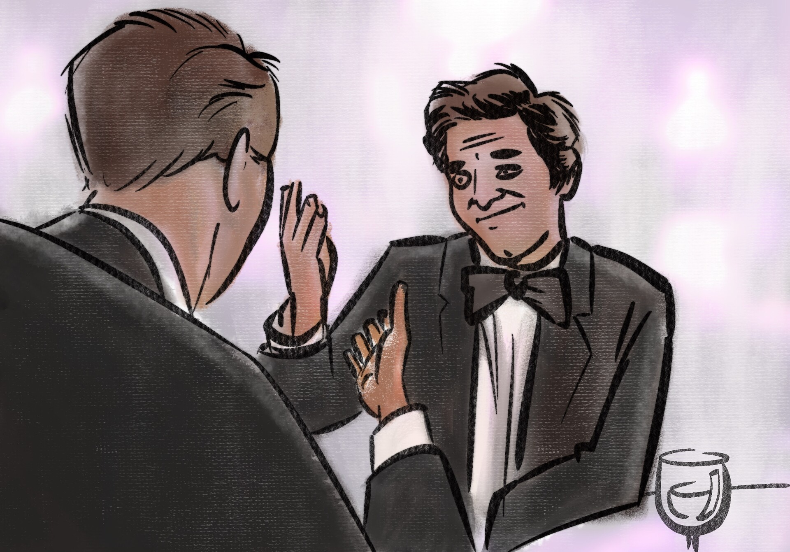
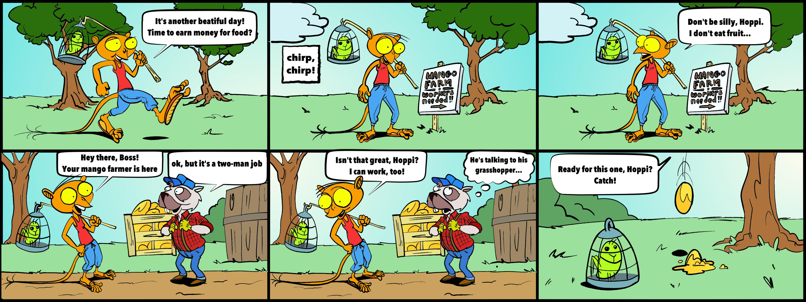
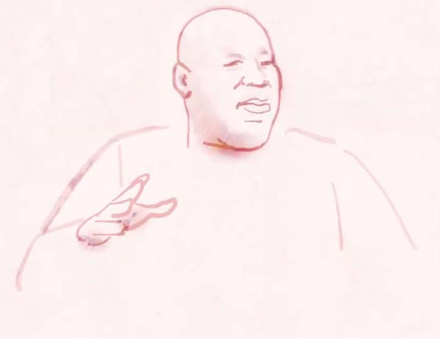
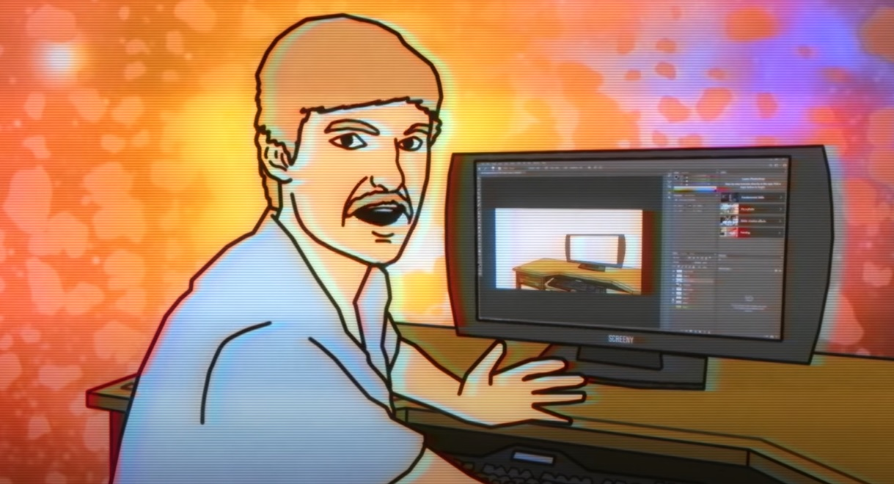
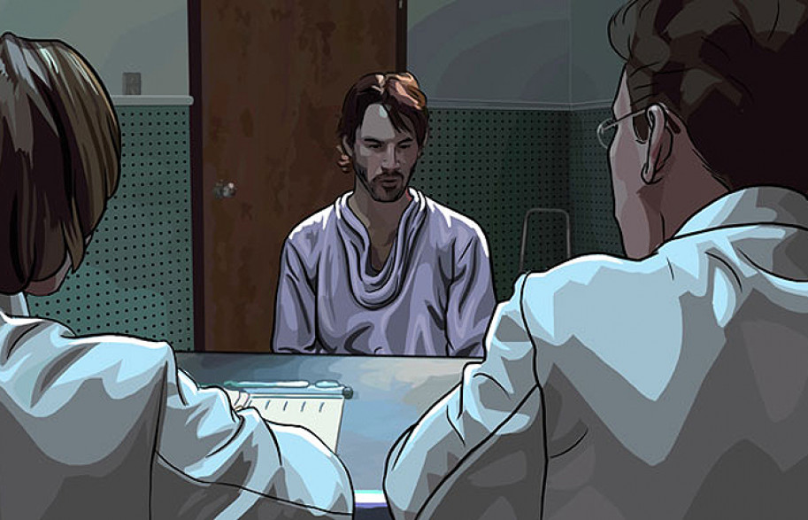
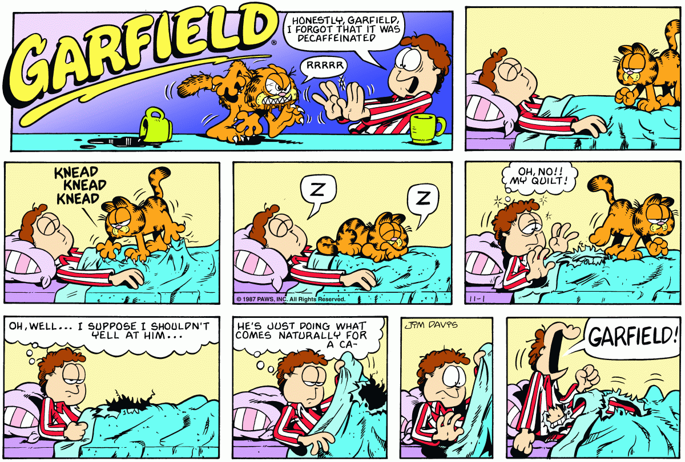

# Cours 3
## Est-ce qu'un secteur économique ou un type de produit m'attire en particulier? 
Ideally I would like to be an artistic director and find uncommon solutions to create an original aesthetic and stand out from the competition 

## Les styles qui m'intéressent

I love the benefits of technology to automate workloads, but aesthetically keeping things classic and organic.  For example, I used effects in my digital sketches to give an aesthetic of drawing in physical mediums.  Also, I have developed my own effects in After Effects to automate these textures with video as a source and adding final touches of rotoscope for the main lines (seen in the youtube link)

## Lien vers la curation

The first four examples are my own, followed by examples that influence me. 

Example of Cross hatch effect in After Effects combined with Rotoscoped lines (https://youtu.be/dS1IOkKCs6k)

Influential content:

Joel Haver https://youtu.be/tq_KOmXyVDo

scanner Darkly (movie)

Garfield (circa 1987)
