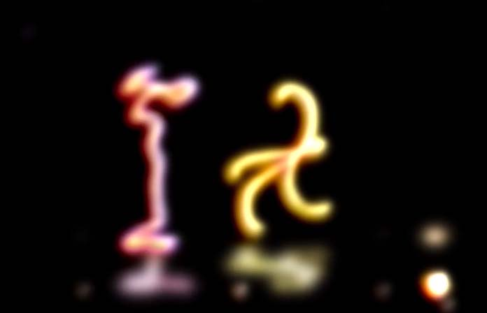

# Cours 09

## Analyse d'un projet créatif

### Le projet créatif

### L'analyse

Animation de lignes dessinées à la main dansant sur de la musique mettant en évidence les lueurs et les reflets dans un logiciel 2D

|Sujet posé |	Sujet divisé |
| --------- | ------------ |
|Le visuel de l'oeuvre	| <ul><li>animated lines that focus entirely on the feeling of motion</li><li> the lines combine the eratic with smooth motion</li></ul>  |
|L’aspect sonore de l’œuvre |<ul><li>use of upbeat techno can alienate some viewers</li><li>Asynchronus tempo to both characters leaves the audience to force a perception of matching the motion to the music</li></ul> 	 |
|La prestation	|<ul><li> music house</li><li> des lignes qui dance </li></ul> 	 |
| Les techniques utilisées	| <ul><li> dessin par main </li><li> post prod avec Toon Boom</li></ul> |

Développement : 
Ce projet est une courte démo montrant ce qui peut être fait en post-traitement en utilisant de simples lignes tracées comme source. En utilisant Toonboom, il crée automatiquement des ombres, des reflets, des effets lumineux et des reflets. Cependant, il est grossier et manque d'éléments de netteté, ce qui lui donne une esthétique trop floue.

Conclusion : 
C'est un bon exemple d'utilisation de Toon Boom pour créer des effets, mais le message est manquant. Le spectateur est laissé à critiquer cela dans son ensemble et peut le juger de manière critique sur son esthétique finale
